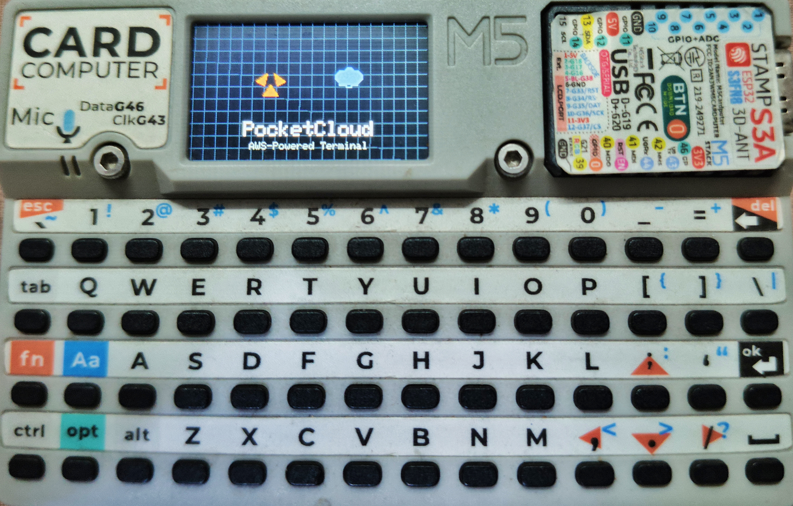

# PocketCloud Terminal — Handheld AWS EC2 Controller for M5Stack Cardputer



A lightweight handheld cloud control firmware for the M5Stack Cardputer v1.1. It enables secure monitoring and management of AWS EC2 instances directly from a portable device. 

## Project Overview

PocketCloud Terminal turns your M5Stack Cardputer into a portable EC2 remote controller. It connects to Wi-Fi, fetches instance states, and can start or stop instances using a secure API Gateway/Lambda proxy.

**Architecture Flow:**

Cardputer -> Wi-Fi -> Authentication -> API Gateway + Lambda -> AWS EC2

## Technical Specifications

### Hardware Requirements
- **Device**: M5Stack Cardputer v1.1
- **SoC**: ESP32-S3 (Xtensa dual-core @ 240MHz)
- **Flash**: 8MB
- **PSRAM**: 16MB
- **Wi-Fi**: 2.4GHz only (ESP32-S3 does not support 5GHz)

### Firmware Specifications
| Parameter | Value |
|-----------|-------|
| Loop task stack | 32KB (increased for TLS + HTTPClient) |
| Monitor speed | 115200 baud |
| Flash speed | 921600 |
| Partition scheme | default (8MB flash) |

### Core Dependencies
| Library | Version | Purpose |
|---------|---------|---------|
| M5Cardputer | ^1.1.1 | Cardputer hardware abstraction |
| M5Unified | ^0.2.14 | Unified M5Stack API |
| M5GFX | ^0.2.20 | Graphics rendering |
| ArduinoJson | ^6.21.6 | JSON serialization |

### Supported AWS Regions
Any region with API Gateway and Lambda support. Ensure the Lambda function is deployed to the same region as your EC2 instances.

## Project Structure

```text
aws-cardputer/
├── DEPLOYMENT_GUIDE.md        # Comprehensive deployment and setup instructions
├── README.md                  # This document
├── include/
│   └── hardware_config.h      # Hardware constants and configuration
├── lambda/
│   └── ec2_proxy/
│       ├── deploy.ps1         # Windows deployment script for AWS SAM
│       ├── handler.py         # Lambda backend Python logic
│       ├── requirements.txt   # Lambda dependencies
│       └── template.yaml      # AWS SAM template for the API proxy
├── platformio.ini             # PlatformIO build configuration
└── src/
    └── main.cpp               # Main firmware source code
```

## How It Works

1. **Boot**: The device boots and plays an animated initialization sequence.
2. **Network**: It connects to a saved Wi-Fi network or prompts the user to scan and connect.
3. **Setup**: The device loads AWS credentials from non-volatile storage (NVS) or SD card. An embedded local web server starts, allowing easy configuration via a browser.
4. **Fetching**: The user presses `[E]` to fetch EC2 instances. The firmware authenticates with AWS via the API proxy.
5. **Control**: The display lists instances with color-coded status indicators. The user selects an instance and presses `[T]` or `[E]` to toggle power (start/stop).

## Installation

```bash
# Clone the repository
git clone https://github.com/ch1n7u/aws-cardputer.git
cd aws-cardputer

# Install PlatformIO dependencies
pio lib install

# Build the firmware
pio run
```

## Firmware Build

Upload the firmware to the Cardputer over USB using PlatformIO:

```bash
# Upload to device
pio run --target upload

# Monitor serial output
pio device monitor --baud 115200
```

## AWS Deployment

To securely route requests from your Cardputer to your AWS EC2 instances, deploy the backend proxy to your AWS account. The backend uses API Gateway, AWS Lambda, and DynamoDB.

### Prerequisites

Before deploying the backend proxy, ensure you have set up your AWS environment:
1. **AWS Account**: You need an active AWS Account.
2. **IAM User**: Create an IAM User with AdministratorAccess, or equivalent permissions for CloudFormation, Lambda, API Gateway, IAM, and DynamoDB.
3. **AWS CLI Setup**: Install the [AWS CLI](https://aws.amazon.com/cli/) and run `aws configure` to set your `AWS Access Key ID`, `AWS Secret Access Key`, and default region name, for example `ap-south-1`.
4. **AWS SAM CLI**: Install the [AWS SAM CLI](https://docs.aws.amazon.com/serverless-application-model/latest/developerguide/install-sam-cli.html).

### Deployment Steps

1. Open PowerShell and, if script execution is restricted, allow local scripts for this session:

```powershell
Set-ExecutionPolicy -ExecutionPolicy RemoteSigned -Scope CurrentUser
```

2. Change into the backend deployment folder:

```powershell
cd .\lambda\ec2_proxy
```

3. Deploy the stack. The script runs `sam build` and `sam deploy` for you, and it generates missing secrets if you do not pass them:

```powershell
.\deploy.ps1 -StackName "ec2-proxy-stack" -Region "ap-south-1"
```

If you want to provide your own values instead of auto-generated secrets:

```powershell
.\deploy.ps1 -StackName "ec2-proxy-stack" -Region "ap-south-1" -AdminToken "YOUR_ADMIN_TOKEN" -PairCode "YOUR_PAIR_CODE" -TokenSigningKey "YOUR_TOKEN_SIGNING_KEY"
```

After the script completes it will print only the `AdminToken`, `PairCode`, and the API Gateway URL. Please save these values and update the device configuration in the web interface.

4. If you need to run the SAM build manually, use:

```powershell
sam build --template-file template.yaml
```

## Device Configuration

Configuration can be performed directly on the device by pressing `[S]` or via the local web interface by navigating to the device's IP address.

**Configuration Options:**
- **AWS Proxy**: API Gateway URL, Pair Code, Legacy Admin Token.
- **Security**: Device 4-digit PIN lock.
- **Network**: Wi-Fi SSID and Password.

Settings can be exported/imported using an SD card with an `/ec2.conf` file.

## Security Model

- **Proxy Auth**: Pair code exchange retrieves short-lived access and refresh tokens, verified via HMAC SHA-256 using a hardware-bound key derived from the device's ESP32 MAC address.
- **Storage Security**: NVS credentials are XOR encoded with a key derived from `ESP.getEfuseMac()` (format: `XXXXXXXXXXXXXXXX`). Encrypted values are stored as hex strings (`token_enc`, `pair_code_enc`, etc.).
- **Access Control**: On-device settings UI is protected by a 4-digit PIN.
- **PIN Recovery**: If PIN is forgotten, flash firmware via USB to reset. SD card config file import also requires physical access to the device.

### Token Flow
1. Device + Pair Code → `/pair` → Access Token (short TTL) + Refresh Token
2. Access Token expired → `/refresh` → New Access Token (using Refresh Token)
3. Credentials stored encrypted in NVS

### Why NTP is Required
TLS certificate validation requires accurate system time. On first boot or after extended storage, the device syncs time via NTP before any HTTPS request. If time sync fails, a fallback timestamp (2025-01-01) is used, which may cause TLS verification failures for some endpoints.

## API Contract

The device communicates with the EC2 proxy via the following endpoints:

### POST /pair
**Purpose:** Register device and exchange pair code for tokens.

**Request:**
```json
{
  "deviceId": "cardputer-XXXXXXXX",
  "pairCode": "XXXX-XXXX"
}
```

**Response (200):**
```json
{
  "accessToken": "<jwt-or-opaque-token>",
  "refreshToken": "<opaque-token>",
  "expiresIn": 3600
}
```

### POST /refresh
**Purpose:** Refresh expired access token.

**Request:**
```json
{
  "deviceId": "cardputer-XXXXXXXX",
  "refreshToken": "<refresh-token>"
}
```

**Response (200):** Same as `/pair`

### GET /instances
**Purpose:** List EC2 instances authorized for this device.

**Headers:**
- `Authorization: Bearer <access-token>`
- `X-Device-Id: cardputer-XXXXXXXX`

**Response (200):**
```json
{
  "instances": [
    {
      "InstanceId": "i-0123456789abcdef0",
      "Name": "web-server-prod",
      "State": "running"
    }
  ]
}
```

### POST /instances/{instanceId}/{action}
**Purpose:** Execute action on an instance.

**Actions:** `start`, `stop`, `reboot`

## Troubleshooting

| Symptom | Likely Cause | Fix |
|---------|--------------|-----|
| Upload failures | USB cable / driver issue | Unplug/replug USB cable. Install M5Stack UART drivers. |
| Wi-Fi won't connect | Wrong band selected | Ensure connecting to 2.4GHz network (ESP32-S3 doesn't support 5GHz) |
| Wi-Fi won't connect | Wrong password | Press W to re-enter credentials |
| "Clock sync failed" | NTP blocked/failed | Check internet access. Device attempts pool.ntp.org, time.google.com, time.aws.com |
| AWS auth failure | Invalid pair code | Verify pair code via web interface `/debug` endpoint |
| "Unauthorized" error | Tokens expired | Re-pair device via web interface, or update pair code in settings |
| TLS errors | System time wrong | After extended storage, force NTP sync by toggling Wi-Fi |
| SD config import fails | Wrong file format | Must be FAT32. Required file: `/ec2.conf` (see format below) |
| SAM CLI not found | Not in PATH | Install AWS SAM CLI and restart terminal |

### SD Card Configuration File Format
The SD card must be formatted as FAT32. Place `/ec2.conf` in the root:
```
url=https://abc123.execute-api.region.amazonaws.com/Prod
token_enc=<xor-hex-encoded-token>
pair_code_enc=<xor-hex-encoded-pair-code>
device_id=cardputer-XXXXXXXX
```

### Accessing Device Debug Info
Navigate to `http://<device-ip>/debug` in a browser to see:
- Wi-Fi status and IP
- Token and pair code state
- System clock value
- Last EC2 error message

## Limitations

| Limitation | Detail |
|------------|--------|
| No SSH | SSH terminal access is NOT currently implemented |
| Wi-Fi bands | Only supports 2.4GHz (ESP32-S3 hardware limitation) |
| Instance display | Abbreviated names (max 24 chars shown on screen) |
| Instance list | Capped at `MAX_INSTANCES` compile-time constant to conserve RAM |
| Token storage | Credentials encoded, not encrypted — physical access to device + SD card extraction could expose data |
| PIN storage | PIN is stored as XOR-encode, not hashed — determined attacker could recover |

## Feature Status

| Feature | Status |
|---------|--------|
| Wi-Fi connection | ✅ Implemented |
| EC2 instance list | ✅ Implemented |
| Start/Stop/Reboot EC2 | ✅ Implemented |
| Web configuration UI | ✅ Implemented |
| SD card config import | ✅ Implemented |
| PIN lock | ✅ Implemented |
| SSH terminal | 🔜 Planned |
| Command relay mode | 🔜 Planned |
| ANSI color terminal | 🔜 Planned |

## Contributing

Contributions are welcome! Please adhere to standard pull request workflows and ensure the firmware builds successfully before submitting changes.

## License

This project is open-source and licensed under the MIT License.


