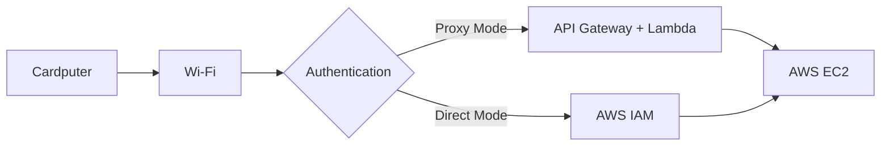

# PocketCloud Terminal — Handheld AWS EC2 Controller for M5Stack Cardputer

A lightweight handheld cloud control firmware for the M5Stack Cardputer v1.1. It enables secure monitoring and management of AWS EC2 instances directly from a portable device. 

## Project Overview

PocketCloud Terminal turns your M5Stack Cardputer into a portable EC2 remote controller. It connects to Wi-Fi, fetches instance states, and can start or stop instances using either a secure API Gateway/Lambda proxy or Direct AWS IAM integration.

**Architecture Flow:**


## Current Features

**Implemented:**
- Wi-Fi network scanning, password entry, and automatic reconnection
- Built-in local web server for configuration
- AWS API Gateway & Lambda proxy authentication (Bearer Tokens & Pairing Codes)
- Direct AWS Mode (IAM Access Key/Secret AWSv4 signing on-device)
- EC2 instance status polling and listing
- EC2 instance power control (Start/Stop)
- Animated boot sequence and UI with battery and Wi-Fi status indicators
- On-device settings UI protected by a 4-digit PIN
- Secure settings persistence (XOR encoded in NVS)
- SD card support for config import/export (`/ec2.conf`, `/wifi.conf`)

**Upcoming Features:**
- SSH shell access
- Terminal UI and ANSI color support
- Command relay mode

## Hardware Requirements

- **Device**: M5Stack Cardputer v1.1
- **MCU**: ESP32-S3 (STAMP-S3A)
- **Cables**: USB-C cable for power and programming
- **Network**: 2.4GHz Wi-Fi connection
- **Storage**: Optional MicroSD card (FAT32) for config management

## Software Requirements

- Visual Studio Code
- PlatformIO IDE extension or CLI
- AWS CLI v2 (for backend deployment)
- AWS SAM CLI (for backend deployment)
- Python 3.11+
- Git

## Project Structure

```text
aws-cardputer/
├── DEPLOYMENT_GUIDE.md        # Comprehensive deployment and setup instructions
├── README.md                  # This document
├── include/
│   └── hardware_config.h      # Hardware constants and configuration
├── lambda/
│   └── ec2_proxy/
│       ├── deploy.ps1         # Windows deployment script for AWS SAM
│       ├── handler.py         # Lambda backend Python logic
│       ├── requirements.txt   # Lambda dependencies
│       └── template.yaml      # AWS SAM template for the API proxy
├── platformio.ini             # PlatformIO build configuration
└── src/
    └── main.cpp               # Main firmware source code
```

## How It Works

1. **Boot**: The device boots and plays an animated initialization sequence.
2. **Network**: It connects to a saved Wi-Fi network or prompts the user to scan and connect.
3. **Setup**: The device loads AWS credentials from non-volatile storage (NVS) or SD card. An embedded local web server starts, allowing easy configuration via a browser.
4. **Fetching**: The user presses `[E]` to fetch EC2 instances. The firmware authenticates with AWS directly or via the API proxy.
5. **Control**: The display lists instances with color-coded status indicators. The user selects an instance and presses `[T]` or `[E]` to toggle power (start/stop).

## Installation

```bash
# Clone the repository
git clone https://github.com/YOUR_REPO/aws-cardputer.git
cd aws-cardputer

# Install PlatformIO dependencies
pio lib install

# Build the firmware
pio run
```

## Firmware Build

Upload the firmware to the Cardputer over USB using PlatformIO:

```bash
# Upload to device
pio run --target upload

# Monitor serial output
pio device monitor --baud 115200
```

## AWS Deployment

The backend proxy is optional if you use Direct AWS Mode. To deploy the proxy via AWS SAM:

1. Generate secure tokens (AdminToken, PairCode, TokenSigningKey).
2. Ensure AWS SAM CLI and AWS CLI are configured.
3. Deploy the SAM stack using PowerShell:

```powershell
cd lambda/ec2_proxy
.\deploy.ps1 `
  -StackName "ec2-proxy-stack" `
  -Region "ap-south-1" `
  -AdminToken "YOUR_ADMIN_TOKEN" `
  -PairCode "YOUR_PAIR_CODE" `
  -TokenSigningKey "YOUR_SIGNING_KEY"
```
4. Note the output `Ec2ProxyApiEndpoint` and enter it into the device configuration.

## Device Configuration

Configuration can be performed directly on the device by pressing `[S]` or via the local web interface by navigating to the device's IP address.

**Configuration Options:**
- **AWS Proxy**: API Gateway URL, Pair Code, Legacy Admin Token.
- **Direct AWS Mode**: AWS Region, Access Key ID, Secret Access Key.
- **Security**: Device 4-digit PIN lock.
- **Network**: Wi-Fi SSID and Password.

Settings can be exported/imported using an SD card with an `/ec2.conf` file.

## Security Model

- **Proxy Auth**: Uses a pairing code exchange to retrieve short-lived access and refresh tokens, verified via HMAC SHA-256.
- **Direct AWS**: AWS V4 Signature HMAC SHA-256 generation is executed directly on the device.
- **Storage Security**: All credentials stored in Preferences NVS are XOR encoded using a hardware-specific MAC address key to prevent casual dumping.
- **Access Control**: The on-device settings UI is protected by a 4-digit PIN.

## Troubleshooting

- **Upload Failures**: Unplug/replug the USB cable. Ensure M5Stack Cardputer drivers (USB to UART Bridge) are properly installed.
- **Wi-Fi Issues**: Ensure you are connecting to a 2.4GHz network. The ESP32-S3 does not support 5GHz Wi-Fi.
- **AWS Auth Failure**: Check device clock synchronization. TLS and AWS requests require accurate time via NTP. Verify your pairing code or AWS access keys via the local web interface `/debug` endpoint.
- **SAM CLI Missing**: Ensure `aws-sam-cli` is installed and in your system PATH. Restart PowerShell after installation.

## Limitations

- **No SSH**: SSH terminal access is NOT currently implemented.
- **Memory Limits**: The EC2 instance list is constrained to a predefined maximum limit to save RAM.
- **Display Constraints**: The UI displays abbreviated instance names to fit the Cardputer screen.
- **Wi-Fi Bands**: Only supports 2.4GHz Wi-Fi.

## Roadmap

**Planned Features:**
- SSH terminal access integration
- Command relay mode
- Full ANSI color terminal output

## Contributing

Contributions are welcome! Please adhere to standard pull request workflows and ensure the firmware builds successfully before submitting changes.

## License

Respect repository license. Please see the root directory for any LICENSE files.
